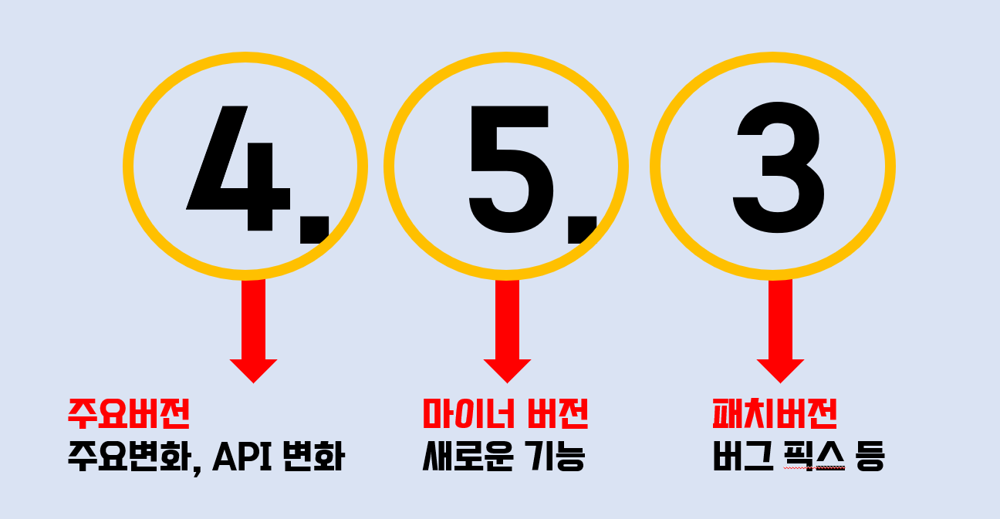

# NPM 정리

이제 HTML, CSS, JS를 어느정도 배워서 간단한 포트폴리오 웹 사이트를 만들고 싶은데 뭔가 애니메이션 요소를 쓰고 싶다고 생각했다. 
&nbsp;그러던 중 [Swiper](https://swiperjs.com/)라는 걸 발견했고 이런 걸 사용할 때 NPM이라는 걸 사용해서 쉽게 다운로드 받는거 같은데 오늘은 Package를 만드는 법이 아닌 진짜 이용하는 법만 적어 놓을 예정이다.

# Node Package Manager

- Node JS 설치 필요
- 자바스크립트 (모듈, 라이브러리)
- 모듈과 패키지의 설치, 이동, 설정
- 개발자간의 공유 또는 재사용

# Node JS 설치 하기

- [Node JS 공식 홈페이지](https://nodejs.org/ko/) 홈페이지에 접속 해서 LTS 버전을 다운로드 한다.  Node.js를 설치하게 되면 npm도 따라서 설치가 된다.
- [npm 홈페이지](https://www.npmjs.com/) 여기서는 원하는 패키지가 존재하는지 찾아볼 수 있다. npm의 git 같은 거라고 볼 수 있겠다.
- 정상적으로 설치 되었는지 확인 알고 싶다면 명령 프롬프트 창에서 `node --version` 과 `npm --version`을 입력하면 설치된 버전이 출력되게 된다.

# package.json 생성하기

- 원하는 폴더로 가서 CMD 창을 열거나 CMD 창에서 원하는 경로로 진입하여 `npm init` 을 입력하거나 `npm init -y`를 입력한다. `init`을 할때 설정을 물어보는데 설정을 기본값으로 하여 아무것도 하지 않고 저장 할 경우 `npm init -y`를 사용한다.
- 추후에 `json`파일을 수정 할 수 있기 때문에 크게 문제 없을 듯 하다.
- 파일 생성시 초기화 되는 각종 설정을 수정하고 싶다면 `npm config edit`을 입력하여 원하는 초기 설정 값을 수정 해놓으면 다음에 `init`파일을 생성할 때 적용할 수 있다.

# package 설치 / 삭제 / 이동 하기

## 설치

- CMD 창에서 `npm install [원하는 패키지 이름] --save` 이렇게 입력하게 되면 패키지가 설치 되면서 `package-lock.json`파일이 생성된다.  &nbsp;패키지 잠금 파일에는 프로젝트에 패키지에 최초로 추가될 당시에 정확히 어떤 버전이 설치 되었는지를 기록하여 `package-lock.json`파일에 패키지 버전이 기록된 상태에서 다시 같은 패키지를 install하게 되면, `package-lock.json` 에 기록된 버전으로 설치되어 버전이 나뉘는 현상을 막아준다.

## 삭제

- CMD창에서 `npm remove [삭제 원하는 패키지 이름] --save`를 입력하면 삭제 해당 package가 삭제 되며 `package-lock.json` 내부에 버전 기록들도 삭제 되게 된다.

## 이동

- 프로젝트를 배포하거나 폴더를 이동할 경우 `package.json`과 `package-lock.json`파일만 이동하여 해당 경로에서 CMD창을 열어 `npm install`만 입력해주면 자동으로 `package.json`과 `package-lock.json`을 읽어 들여 동일한 버전의 라이브러리와 모듈을 자동으로 설치해준다.
- `package.json` 통해서 설치를 할 때 그냥 설치하면 `devDependencies` 파일까지 전부 설치 되지만 `npm install --production` 이라고 입력하면 `application` 구동에만 필요한 `dependencies`파일들만 다운로드 된다.

## 패키지 지정

- install 할 때 `--save`를 해주는데 이는 `package.json`파일을 보면 패키지를 지정하는 방식이 `dependencies`와 `devDependencies`로 나뉘기 때문입니다. 만약 로컬 개발 및 테스트 에만 필요한 패키지 라면 `devDependencies`설정하는 것이 맞고 install 하실 때 끝에`--save-dev` 해주면 됩니다.

`dependencies` : Application을 구동하는데 필요한 패키지 
`devDependencies`: 로컬 개발 및 테스트에만 필요한 패키지

# Version
## Version 을 나누는 기준

## package.json의 버전 규칙
- `^` : 마이너 버전을 install시 항상 업데이트
- `~` : 마이너 버전은 유지하고, 버그 픽스가 일어난 경우 install시 업데이트
- `*` : 무조건 최신 버전으로 업데이트
- 아무것도 없을 시 특정 버전만 다운로드
- 재 install 시 해당 위 사항이 적용되려면 `package-lock.json`이 없어야한다.
- `npm update [package name]` 으로 업데이트 가능하다.
## Version 다운로드 지정 하기
- 특정 버전 다운로드 :  `npm install [package name]@[원하는 version]`
- 글로벌 다운로드 :  `npm install [package name] -g`
- - 보통 node_modules 폴더에 다운로드 되는데 이렇게 다운로드하면 전역 경로에 사용됨 live server나 nodemon 같이 전역에서 사용되는 것을 설치할 때 사용

# NPM script
- `package.json`에 보면 `script`라는 항목을 볼 수 있는데 해당 항목에는 자주 사용하면 명령들의 단축어를 설정할 수 있게 해준다.  git 에서 alias 와 같이 사용할 수 있다고 보면된다. 
[npm script 등록 방법](https://ithub.tistory.com/186)

# 그 외 npm 명령어 모음
[zerocho: 명령어 모음](https://www.zerocho.com/category/NodeJS/post/58285e4840a6d700184ebd87)

# 참고
- https://www.zerocho.com/category/NodeJS/post/58285e4840a6d700184ebd87
- https://velog.io/@skyepodium/package.json
- https://www.daleseo.com/js-package-locks/
- https://www.youtube.com/watch?v=9xPhCeAlzzk&ab_channel=codeScalper
